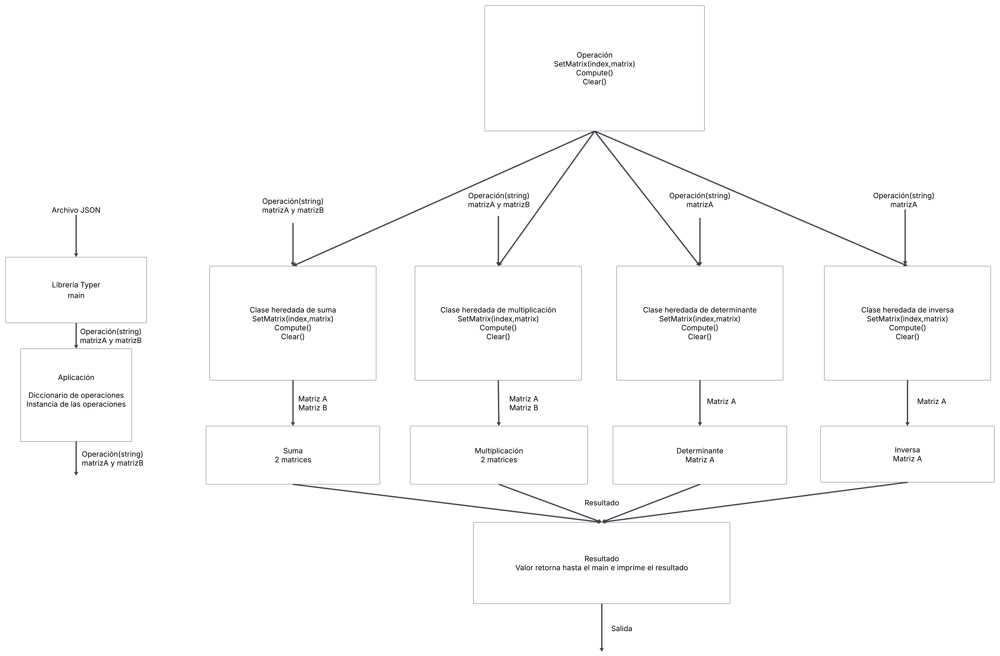

# Lab 1 — Calculadora de Matrices

## Tabla de contenidos

- [Descripción del proyecto](#descripción-del-proyecto)
- [Diagrama del diseño](#diagrama-del-diseño)
- [Instalación](#instalación)
- [Uso](#uso)
- [Ejemplos](#ejemplos)
- [Integrantes](#integrantes)

## Descripción del proyecto

Este proyecto consiste en el desarrollo de una calculadora de matrices utilizando Python.

La aplicación permite cargar matrices desde archivos en formato JSON y realizar las siguientes operaciones:

- Suma de matrices.
- Multiplicación de matrices.
- Cálculo del determinante.
- Cálculo de la matriz inversa.

El proyecto utiliza una arquitectura basada en una interfaz común para las operaciones y clases concretas que implementan cada operación. La aplicación cuenta además con una interfaz de línea de comandos desarrollada con **Typer** y utiliza **uv** para la gestión del entorno y las dependencias del proyecto.

Las matrices se representan como arreglos bidimensionales de números de punto flotante y el archivo JSON especifica sus dimensiones y datos.

## Diagrama del diseño



## Instalación

### Requisitos

Se requiere:

- uv.

### Clonar el repositorio

```bash
git clone https://github.com/Chalo06/Lab_1.git
```
Y ubicarse en la dirección de la carpeta cd .../Lab_1

### Crear el entorno e instalar las dependencias

El proyecto utiliza `uv` para gestionar el entorno virtual y las dependencias.

Ejecute:

```bash
uv sync
```

Esto crea el entorno virtual del proyecto e instala las dependencias especificadas en `pyproject.toml`.

## Uso

La aplicación se ejecuta desde la terminal mediante:

```bash
uv run main.py <operacion> /example/test.json
```

Las operaciones disponibles son:

| Operación        | Descripción                           |
| ---------------- | ------------------------------------- |
| `suma`           | Suma dos matrices                     |
| `multiplicacion` | Multiplica dos matrices               |
| `determinante`   | Calcula el determinante de una matriz |
| `inversa`        | Calcula la matriz inversa             |


## Ejemplos

Las operaciones pueden ejecutarse de la siguiente manera.

### Suma

```bash
uv run main.py suma matrices.json
```

Resultado:

```text
[[3.0, 2.0, 1.0], [1.0, 4.0, 5.0], [2.0, 1.0, 5.0]]
```

### Multiplicación

```bash
uv run main.py multiplicacion matrices.json
```

Resultado:

```text
[[4.0, 4.0, 1.0], [5.0, 5.0, 11.0], [8.0, 1.0, 7.0]]
```

### Determinante

```bash
uv run main.py determinante matrices.json
```

Resultado:

```text
21.0
```

### Inversa

```bash
uv run main.py inversa matrices.json
```

Resultado:

```text
[[0.47619047619047616, 0.047619047619047616, -0.14285714285714285], [-0.19047619047619047, 0.38095238095238093, -0.14285714285714285], [0.047619047619047616, -0.09523809523809523, 0.2857142857142857]]
```
## Uso de IA
En este laboratorio la IA se utilizo para comprobación de conceptos, orientación desarrollo de pruebas e implementación de partes para eficiencia.
Los links adjuntos muestran la utilización de la IA.
1. https://chatgpt.com/share/6a7f9ee4-bef0-83e8-aded-e7625400a572
2. https://chatgpt.com/share/6a7fa342-8458-83e8-8613-baacbec4e4bd
3. https://chatgpt.com/share/6a7fddb0-d378-83e8-beb9-72c9a126e015

## Integrantes

| Nombre                    | Rol            |
| ------------------------- | -------------- |
| Gerson Cordero Zúñiga     | Líder          |
| Gonzalo Alpízar Salas     | Revisor        |
| Nicole Corrales Rodríguez | Desarrolladora |
| Keilin Loasiga Tellez     | Desarrolladora |

**Curso:** Introducción a la Computación Heterogénea

**Profesor:** Luis Gerardo León Vega
